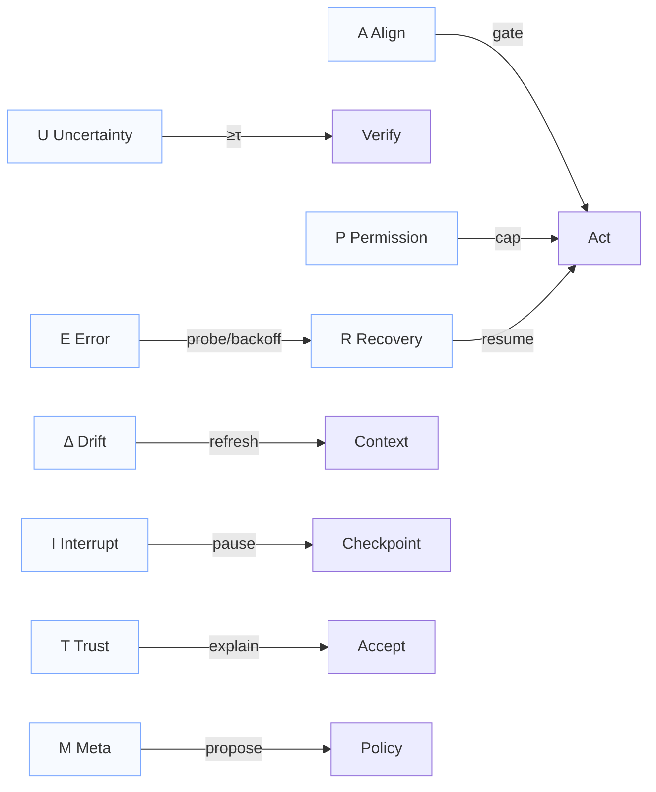

1-liner
- The tiny alphabet of metacognition and control.

diagram (mermaid)

```mermaid
flowchart LR
  A[A Align]:::b -->|gate| Act
  U[U Uncertainty]:::b -->|≥τ| Verify
  P[P Permission]:::b -->|cap| Act
  E[E Error]:::b -->|probe/backoff| R
  D[Δ Drift]:::b -->|refresh| Context
  I[I Interrupt]:::b -->|pause| Checkpoint
  R[R Recovery]:::b -->|resume| Act
  T[T Trust]:::b -->|explain| Accept
  M[M Meta]:::b -->|propose| Policy
  classDef b fill:#f7faff,stroke:#7aa7ff,stroke-width:1px
```

CTA
- Paste into READMEs; use as a legend in diagrams.

